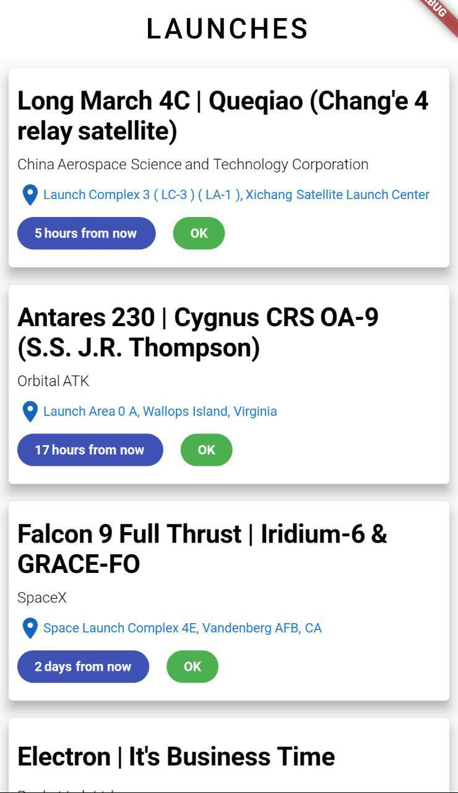

## launchlibrary simple app made with flutter

I made this app to test how really fast is building an app with flutter, wow. I designed, organized the project and made this in 'bout 40 minutes (with interruptions).

Here it is how it looks like (it's bad, ik, but the goal was to build it quickly):

### telegram group: [@dartlang_group](https://t.me/dartlang_group)
### italian group: [@dartlangita](https://t.me/dartlangita)
